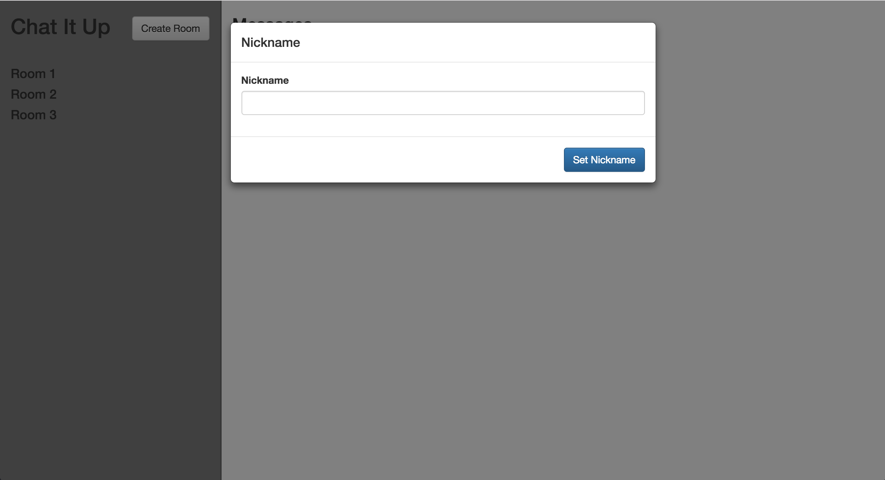
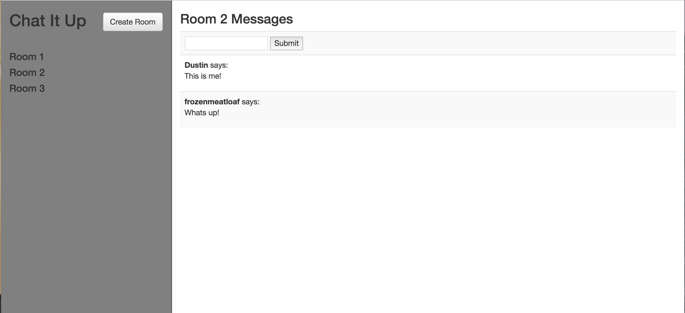
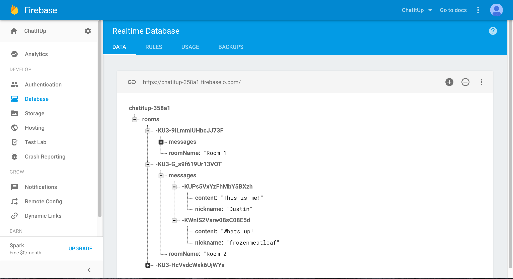

# Chatitup
A real-time chat client using AngularJS and Firebase

## Info

* If new user, you will automatically be prompted to create a username
* Messages, from first to last, delete one-by-one once 25 messages are created.
* Backend utilizes Firebase service. _see_ https://firebase.google.com/features/

## Images

**Chatitup homepage (w/ prompt for user)**

**Chatitup chat room**

**Chatitup database**

## Grunt plugins

A list of the Grunt plugins in this application.

#### Watch

[Grunt watch](https://github.com/gruntjs/grunt-contrib-watch) watches for changes to file content and then executes Grunt tasks when a change is detected.

#### Copy

[Grunt copy](https://github.com/gruntjs/grunt-contrib-copy) copies files from our development folders and puts them in the folder that will be served with the frontend of your application.

#### Clean

[Grunt clean](https://github.com/gruntjs/grunt-contrib-clean) "cleans" or removes all files in your distribution folder (`dist`) so that logic in your stylesheets, templates, or scripts isn't accidentally overridden by previous code in the directory.

#### Hapi

[Grunt Hapi](https://github.com/athieriot/grunt-hapi) runs a server using [`HapiJS`](http://hapijs.com/). Happy is a Node web application framework with robust configuration options.
